# **Backend**

# **Arquitectura limpia**

La arquitectura limpia (Clean Architecture) es una filosofía de diseño de software que separa los elementos de un diseño en niveles de anillo. Un objetivo importante de la arquitectura limpia es proporcionar a los desarrolladores una forma de organizar el código de tal manera que encapsule la lógica empresarial pero la mantenga separada del mecanismo de entrega. 

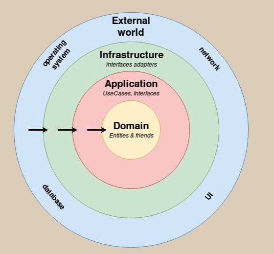

## Dominio 

> backend/api/Domain

En esta capa se visualizan los entities, los cuales contienen toda la lógica y datos del negocio.

Por ejemplo, para una matricula es necesario que exista un alumno con rut, nombre, telefono, etc

## Aplicación

> backend/api/application

En esta capa se encuentran todos los casos de uso del sistema, estos casos de usos representan toda la logica. Cabe mencionar que es inherente a cada aplicación.

> backend/api/application/use_cases

Adicionalmente en esta capa se visualizan todos las interfaces 
de la aplicación.

Estas interfaces sirven para indicar las transacciones a las bases de datos (orm) y integraciones externas, las cuales se implementaran en la siguiente capa. 

En el proyecto las interfaces del ORM se encuentran en la carpeta "repository"

> backend/api/application/respositories

Y las integraciones externas en "ports" (slack)

> backend/api/application/ports

## Infraestructura

En esta capa como su nombre lo dice se encuentran todas las operaciones con el "fierro", en las cuales se encuentran principalmente las interacciones con bases de datos, integraciones de email, etc.

En el proyecto estas integraciones se dividen en adapters (integracions externas) y repositories (orm).

> backend/api/infraestructure/adapters

> backend/api/infraestructure/repositories

## UI, Framworks

En esta ultima capa se encuentra la parte visual de la aplicación y su framework, en este caso como el framework es DJANGO, podemos deducir que en la api se puede encontrar la conexión a base de datos (settings.py), los urls, las views y los serializers.

Para la comunicación entre las capas mencionadas anteriormente, se puede realizar mediante el principio de inversión de dependencias. Las cuales se encuentran implementadas en el archivo

> backend/api/apps.py

# Modelo de datos

El modelo utilizado para la aplicación se presenta a continuación, se utilizo la base de datos por defecto de django (sqlite) la cual es solo un archivo.

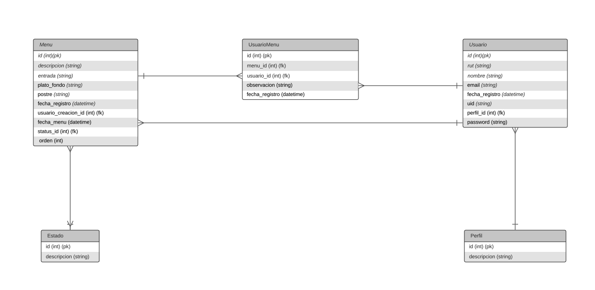

# Instalación

1. **SLACK**

    1. Debe crear un espacio de trabajo, en caso que no tenga, seguir los pasos indicados por slack
    
        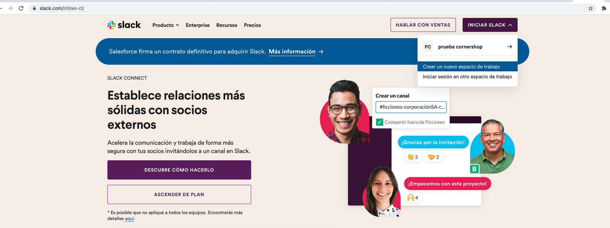

    2. Una vez creado el espacio de trabajo habra slack

    3. Pinchar arriba lado izquierdo (donde sale el nombre del espacio de trabajo)
        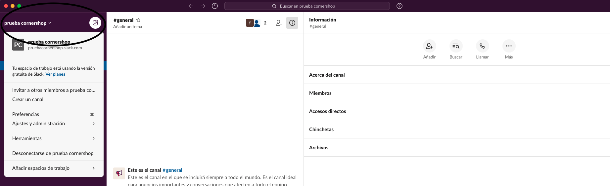
    
    4. Dar click en Ajustes y administración -> Gestionar Aplicaciones
        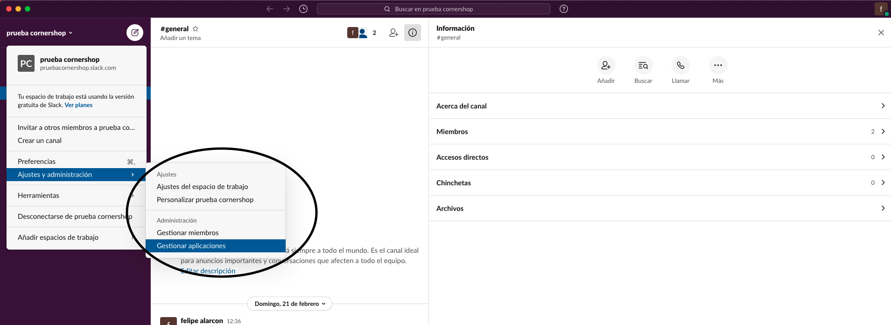

    5. Dar click en crear apps
        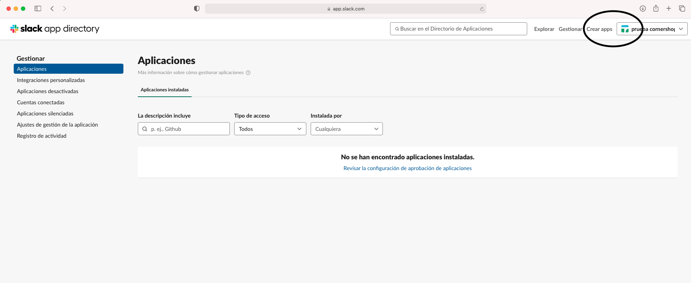

    6. En la nueva ventana pinchar **Create an app**
        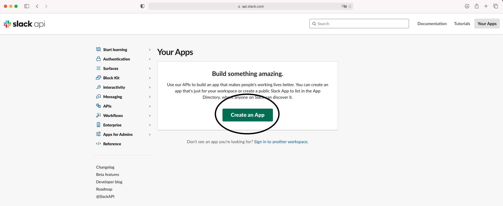

    7. Agregar el nombre de la app y seleccionar el espacio de trabajo creado en el paso 1, para luego pinchar en el botón **Create app**
        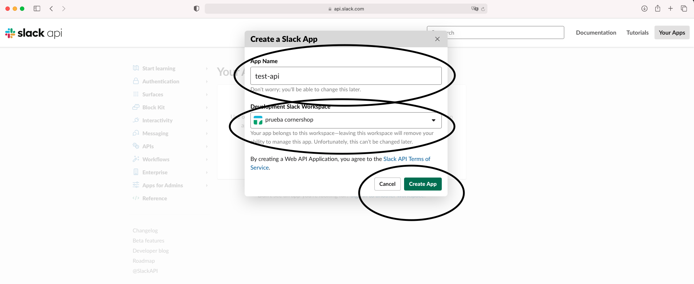

    8. En la nueva ventana ir a la opción **OAuth & Permissions**
        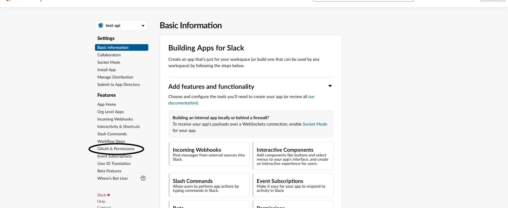

    9. En la nueva pestaña agregar los siguientes **Scopes**
        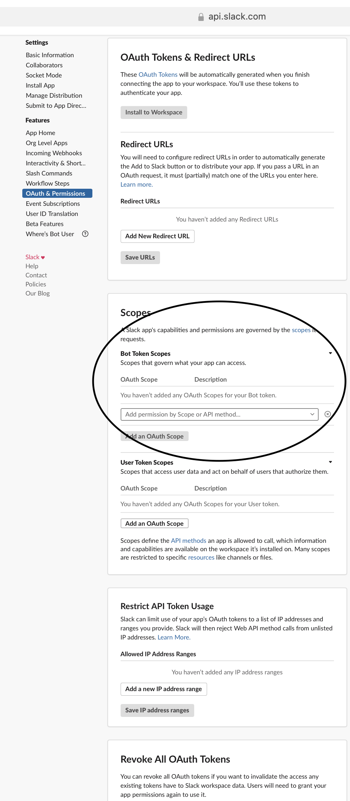
        > chat:write

        > chat:write.customize

        > users:read

        > users:read.email

        > users:write

        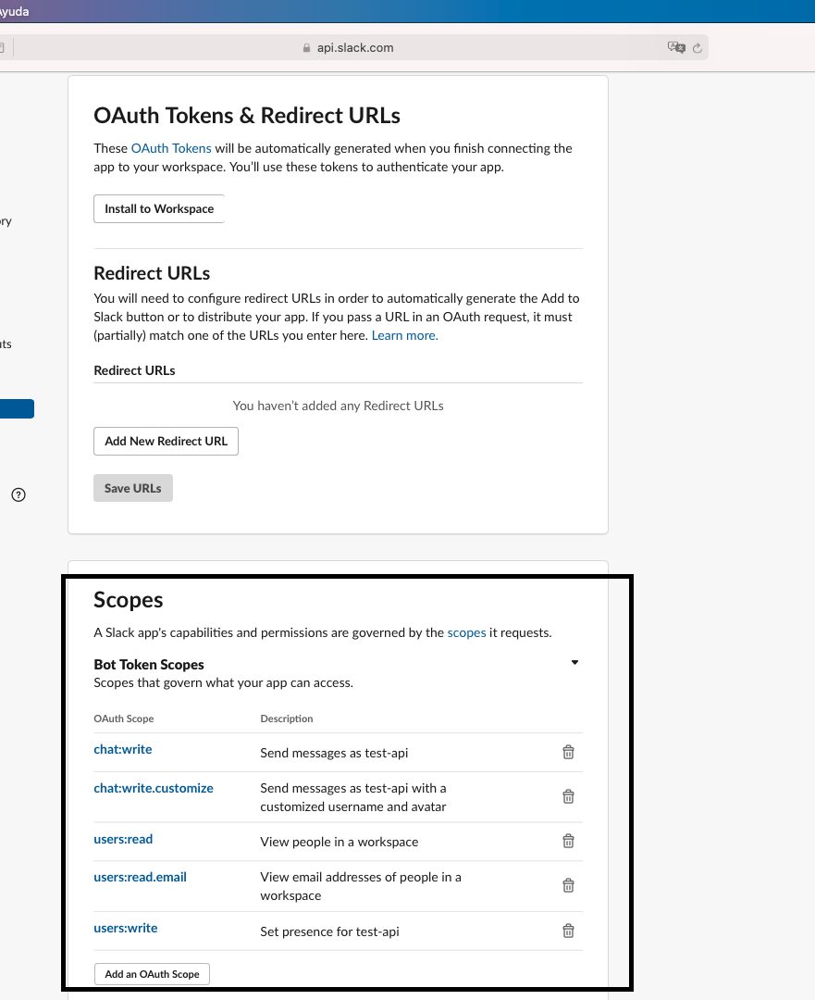

    10. Hacer mismo proceso para **User Token Scopes**, agregando los siguientes permisos

        > chat:write

        > users:read

        > users:write

        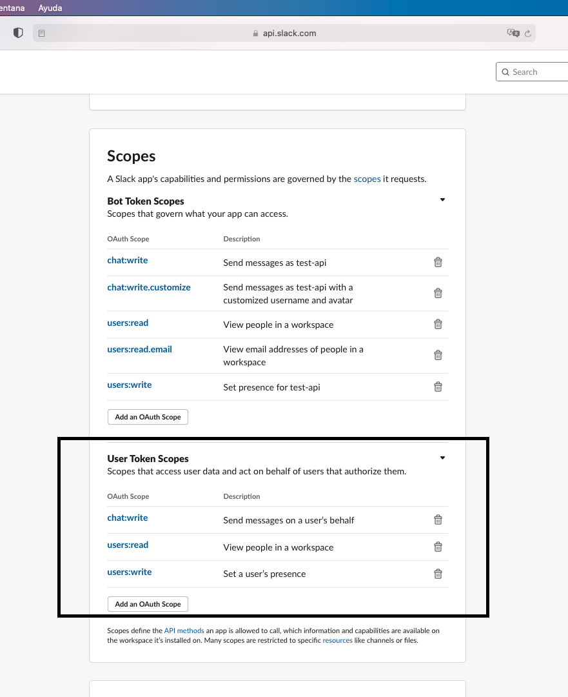

    11. Ir al principio de la aplicación y pinchar el botón **Install to Workspace**
        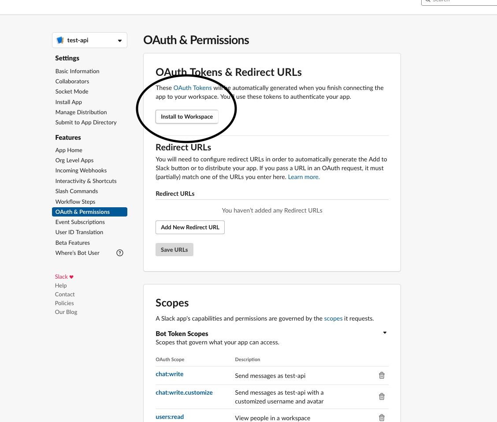

    12. Seleccionar en la nueva ventana eñ botón **Permitir**
        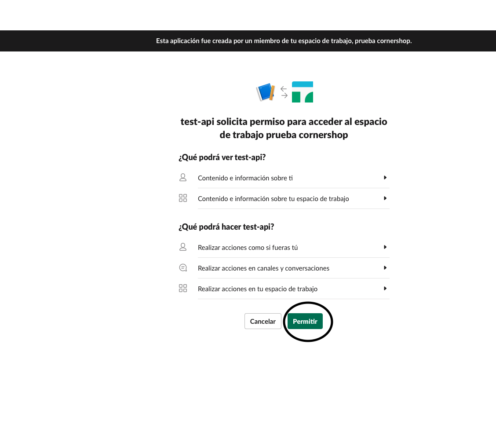

    13. En la nueva pestaña seleccionar el botón **copy**
        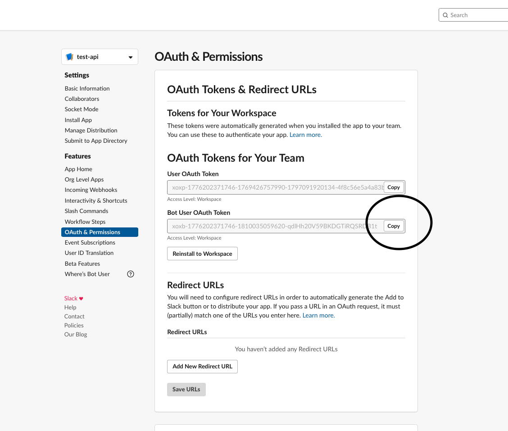

    14. Copiar token en la varible **SLACK_API_TOKEN** del settings.py ubicado en la siguiente ruta

        >backend/config/settings.py

    15. Actualmente el match de lo que se envia es el email, por lo cual cuando se realizen las pruebas, favor agregar email en la tabla usuario con el perfil Empleado de las personas de slack (esto se puede hacer en el mantenedor de usuarios).

# **Frontend**

Para el frontend se utilizo un framework de javascript llamado VUE junto a typescript , el cual trabaja a partir de estados y componentes, todas las apis se llaman a travez de interceptores el cual se define una sola vez con axios.

> frontend/src/services/api.ts

# Levantar proyecto

1. Instalar y correr proyecto:
    1. Backend
        1. Instalar python 3 y virtualenv y levantar env
            > source /backend/env/bin/activate
        2. Instalar requerimientos
            > pip install -r backend/requirements.txt
        3. Inicializar Base de datos
            > rm backend/api/migrations/0001_initial.py
            
            > rm backend/db.sqlite3
            
            > source backend/env/bin/activate
            
            > python backend/manage.py migrate
            
            > python backend/manage.py makemigrations
            
            > python backend/manage.py migrate
            
            > python backend/init_db.py
        4. Correr
            > python backend/manage.py runserver
        5. Correr pruebas unitarias
            > cd backend
            
            > pytest
    2. Frontend
        1. Instalar node desde la pagina https://nodejs.org/en/
        2. Instalar vue
            > npm install vue
        3. Levantar e instalar
            >npm install
            
            >npm run serve
        
# Credenciales

>Usuario: 11.111.111-1

>password: qwerty123

# Logica de negocio

Antes de realizar cualquier acción se deben realizar los cambios en slack, luego iniciar sesión, para posterior a esto ingresar usuarios del tipo de perfil "empleado", de lo contrario el mensaje de slack no le llegara a ninguna persona.
