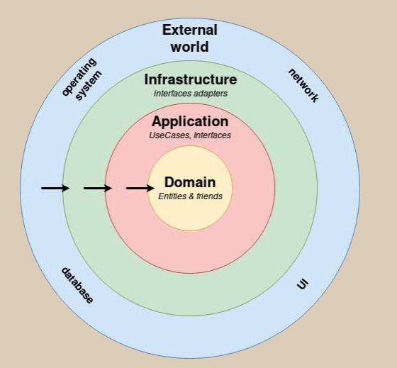

# **Backend**

# **Arquitectura limpia**

La arquitectura limpia (Clean Architecture) es una filosofía de diseño de software que separa los elementos de un diseño en niveles de anillo. Un objetivo importante de la arquitectura limpia es proporcionar a los desarrolladores una forma de organizar el código de tal manera que encapsule la lógica empresarial pero la mantenga separada del mecanismo de entrega. 

## Dominio 

> api/Domain

En esta capa se visualizan los entities, los cuales contienen toda la lógica y datos del negocio.

Por ejemplo, para una matricula es necesario que exista un alumno con rut, nombre, telefono, etc

## Aplicación

> api/application

En esta capa se encuentran todos los casos de uso del sistema, estos casos de usos representan toda la logica. Cabe mencionar que es inherente a cada aplicación.

> api/application/use_cases

Adicionalmente en esta capa se visualizan todos las interfaces 
de la aplicación.

Estas interfaces sirven para indicar las transacciones a las bases de datos (orm) y integraciones externas, las cuales se implementaran en la siguiente capa. 

En el proyecto las interfaces del ORM se encuentran en la carpeta "repository"

> api/application/respositories

Y las integraciones externas en "ports" (slack)

> api/application/ports

## Infraestructura

En esta capa como su nombre lo dice se encuentran todas las operaciones con el "fierro", en las cuales se encuentran principalmente las interacciones con bases de datos, integraciones de email, etc.

En el proyecto estas integraciones se dividen en adapters (integracions externas) y repositories (orm).

>api/infraestructure/adapters

>api/infraestructure/repositories

## UI, Framworks

En esta ultima capa se encuentra la parte visual de la aplicación y su framework, en este caso como el framework es DJANGO, podemos deducir que en la api se puede encontrar la conexión a base de datos (settings.py), los urls, las views y los serializers.

Para la comunicación entre las capas mencionadas anteriormente, se puede realizar mediante el principio de inversión de dependencias. Las cuales se encuentran implementadas en el archivo

> api/apps.py

# Modelo de datos

El modelo utilizado para la aplicación se presenta a continuación, se utilizo la base de datos por defecto de django (sqlite) la cual es solo un archivo.

# Instalación